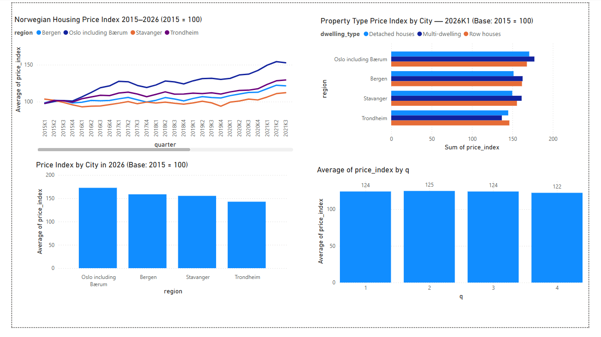

# Norwegian Housing Market Analysis
**Data source:** Statistics Norway (SSB) — Table 07221  
**Period:** 2015–2026 | **Tool:** SQL + Power BI

## What This Project Does
Analysis of the Norwegian housing market using official SSB data.
Built to demonstrate BI Analyst skills relevant to proptech 
and real estate marketplace 

## Key Findings

**1. Bergen is closing the gap with Oslo fast**  
The price gap between Bergen and Oslo peaked at -32 index 
points in 2022 but has narrowed to just -16 by 2026 — 
the smallest gap since 2016.

**2. COVID accelerated prices — interest rates slowed them**  
Contrary to expectations, COVID did not crash Norwegian housing 
prices. From 2020 to 2021 prices surged +16%. The real slowdown 
came in late 2022 when interest rates rose sharply.

**3. Spring is the best time to list**  
Q2 (April–June) consistently has the highest prices every year 
across all cities. A useful insight for advising real estate 
agents on listing timing.

## Files
- `norway_housing_analysis.sql` — 5 business-focused SQL queries
- `norway_housing_price_index.csv` — Clean dataset ready for analysis

## Tools Used
- SQL (SQLite)
- Power BI Desktop
- Python (data cleaning)
- Data source: SSB StatBank
